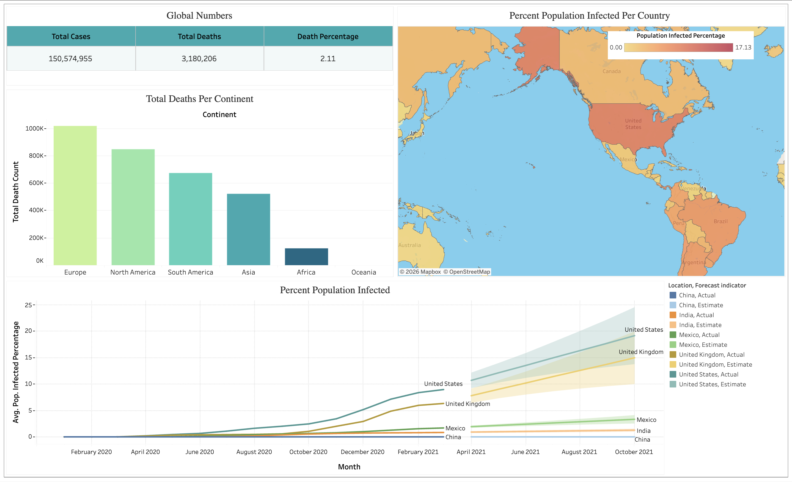

# COVID-19 Global Dashboard (Tableau)

## Project Overview

This Tableau dashboard visualizes global COVID-19 trends, including case counts, death totals, and vaccination progress.

## Dashboard Features

- Global case trends
- Death totals by region
- Vaccination progress
- Interactive filters by location and date

## Tools Used

- Tableau
- SQL
- Excel

## Data Source

Our World in Data COVID-19 dataset.

## Dashboard Preview

## Tableau Public

[View the Tableau Dashboard](https://public.tableau.com/views/COVID-19Dashboard_17720012817120/Dashboard1?:language=en-US&publish=yes&:sid=&:redirect=auth&:display_count=n&:origin=viz_share_link)
